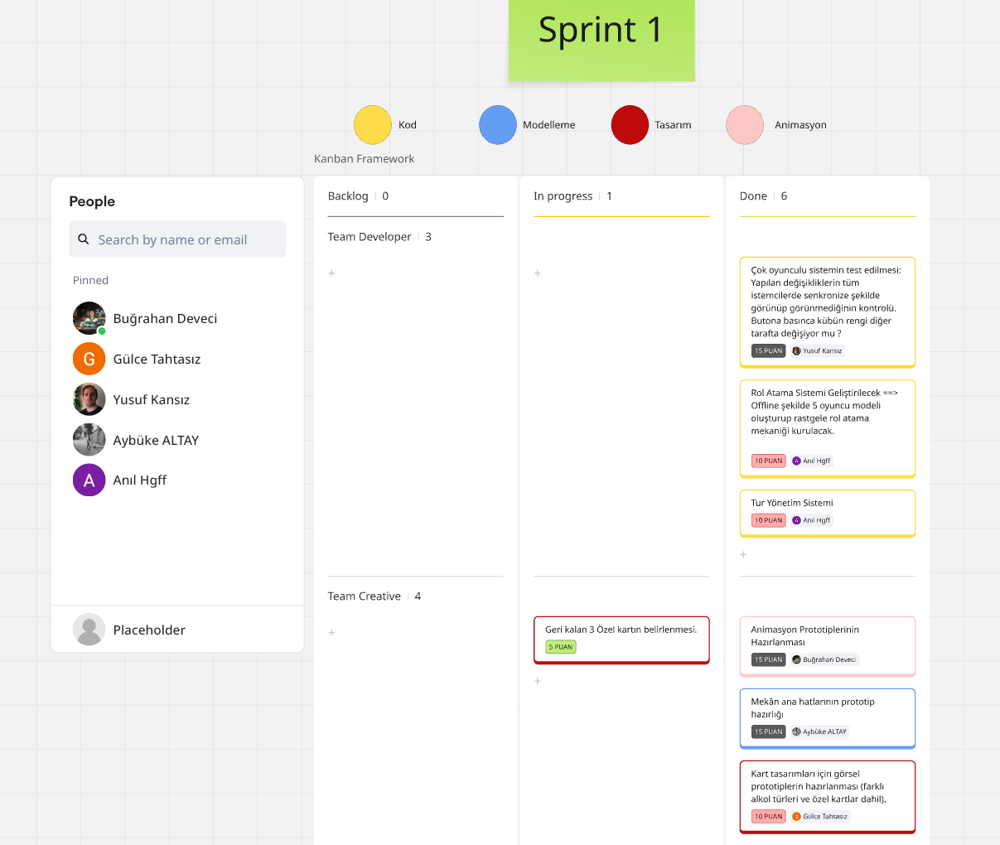

## Team Member

| Photo | Name                | Role          | Socials                                                                                   |
|-------|---------------------|---------------|-------------------------------------------------------------------------------------------|
|  | Gülce Tahtasız | Product Owner  |[LinkedIn](https://www.linkedin.com/in/gülce-tahtasız-528834254/)
|  | Buğrahan Deveci | Scrum Master  |[LinkedIn](https://www.linkedin.com/in/bghrndvc/)
|  | Yusuf Kansız | Developer  |[LinkedIn](https://www.linkedin.com/in/yusuf-kans%C4%B1z?utm_source=share&utm_campaign=share_via&utm_content=profile&utm_medium=android_app)
|  | Anıl Moran | Developer  |[LinkedIn](https://www.linkedin.com/in/an%C4%B1l-moran-a1a736339/)
|  | Aybüke Altay | Developer  |[LinkedIn](https://www.linkedin.com/in/aybüke-altay-a22736344/)

---

## Oyun İsmi
İsim belirlenecek

## Oyun Logosu

Logo gelecek

## Oyun Açıklaması

Vahşi Batı temalı, 5 oyunculu, sürükleyici bir kart oyunudur. Bu oyunda cesur kovboylar ve kurnaz bir barmen arasında akıl oyunları döner. Barmenin tek amacı, tüm kovboyları sarhoş ederek onları saf dışı bırakmaktır. Kovboyların görevi ise ayık kalmak, barmenin hilelerini çözmek ve onu alt etmektir. Strateji, risk ve biraz da şansın birleştiği bu oyunda, her kart ve her tahmin kaderinizi belirleyebilir.

## Oyun Özellikleri
-  3D
-  Multiplayer
-  Part-Game

---

## Pazarlama

  Pazarlama belirlenecek

---
# Product Backlog URL

[Game Bootcamp 47](https://miro.com/app/board/uXjVIjOALLs=/)

# Sprint 1
- Sprint için hedeflenen puan **70** olarak belirlenmiştir.
- **Sprint puan tamamlama mantığı:** Proje süresince tamamlanması hedeflenen toplam backlog puanı 350 olarak belirlenmiştir. İlk Sprint'te ise 70 puanlık bir hedef koyulmuş ve bu hedefe başarıyla ulaşılmıştır.
- **Backlog Düzeni:** Proje backlog'u oluşturulurken, Miro üzerinden "Team Developer" ve "Team Creative" olmak üzere iki ana takıma ayrıldık. Bu süreçte, projenin genel hatlarını belirleyerek gelecek sprintler için gerekli olan script türleri, animasyonlar, modeller, seler ve tasarımları önceden tespit ettik. Kanban panosu oluşturarak, daha önce belirlediğimiz bu materyalleri Sprint 1 için detaylandırdık ve görev dağılımlarını gerçekleştirdik. Görevlerin kolayca ayırt edilebilmesi için renk kodlaması kullandık: sarı kodlamayı, mavi modellemeyi, kırmızı tasarımı, pembe animasyonu ve yeşil ses görevlerini temsil etmektedir. 
- **Daily Scrum:** Whatsapp üzerinden günlük konuşmala sağlanıp, toplantılar içinse Slack üzerinden yapılmıştır. Günlük konuşmalarımız ve Slack toplantılarımız İmgur'da toplamıştır. : https://imgur.com/a/IQ3VAJg
- Proje için ayrılan gruplar şu şekildedir;
  +   **Team Developer:** Yusuf Kansız, Anıl Moran
  +   **Team Creative:** Buğrahan Deveci, Aybüke Altay, Gülce Tahtasız
      + Team Developer projenin mekaniklerini, unity tarafında toplanmasını işlerken Team Creative ise modeller, animasyonlar, sesler, tasarımlarla ilgilendi.
- **Sprint board update:** Sprint Board Screenshot: 
- 
 
<h3>Ürün Durumu: Ekran Görüntüleri</h3>

  
  (https://imgur.com/9B5jmhn)
  (https://imgur.com/xk8eHHx) 
  (https://imgur.com/5DOUHkP)
  (https://imgur.com/5L5KTtf)
  (https://imgur.com/VTUfor9)

  

- **Sprint Review:** Çok oyunculu sistem başarıyla test edildi; buton etkileşimleri tüm istemcilerde senkronize çalıştı. Offline 5 oyunculu rol atama ve tur yönetim sistemi kuruldu. Creative ekip, karakter animasyonlarının prototiplerini oluşturdu, mekânın genel hatlarını tasarlandı. Ayrıca kart tasarımları için farklı karakter tipleri içeren görsel prototipler geliştirildi. Bazı kartlar henüz tamamlanmamış olsa da test için yeterli içerik sağlandı. Sprint hedefi 70 puan olarak belirlenmişti, ancak 5 puanlık “Geri kalan 3 özellik kartının bulunması” görevi iletişim eksikliği nedeniyle tamamlanamadı. Bu nedenle Sprint 1, 65 puan ile tamamlandı.
İlgili görev bir sonraki sprint'e aktarılacak ve görev takibi daha net rollerle yürütülecektir.
  + **Sprint Review katılımcıları:** Buğrahan Deveci, Aybüke Altay, Gülce Tahtasız
- **Sprint Retrospective:**
  - Takım içi iletişimi güçlendirmek amacıyla toplantıların daha düzenli yapılmasına karar verildi. Bundan sonraki süreçte haftada üç gün, belirlenen sabit gün ve saatlerde takım toplantıları gerçekleştirilecek.
  - Bazı görevlerin zamanında tamamlanamaması ve iletişim eksikliği sebebiyle efor-saat planlamasının yetersiz olduğunu gösterdi. Görevler için daha gerçekçi süre tahminleri yapılacak ve her görev için gerekli zaman detaylı şekilde belirlenecek.
  - Görevlerin takibi sırasında bilgi kopuklukları yaşandı. Bir kişinin yaptığı işi Scrum Master ile diğer takım üyelerinin sonradan öğrenmesi zaman kaybına yol açtı. Bu nedenle tüm takım üyelerinin toplantılara eksiksiz katılması artık bir öncelik olması karar verilmiştir.

# Sprint 2

# Sprint 3
